# KID
KID is an effort by me ([Alex Baranski](https://www.linkedin.com/in/alex-baranski-082100a1/)) to construct a robotic arm. I think that one of the major limits of a system is that systems ability to interact with its environment through its sensory and motor apparatuses, and that simulation of an environment for training a system is [1] prone to leaving out important but hard to simulate dynamics that exist in the real world and [2] is less cool. I looked around for a robotic arm I could buy, but there's pretty much nothing in my price range that's any better than a simple claw, which I'm not interested in. So, I decided to just build my own! This is one of several things I'm juggling so new posts are infrequent, but at the end I'll make a single comprehensive tutorial with links to materials and digital resources used in the construction of the "final" iteration.
Because I'm making this from scratch, I have to learn a lot as I go, which is pretty fun. Because I'm also funding it myself, it also has to be cheap. And because I'd like to be able to iterate quickly, rapid manufacturing with limited tools is non-negotiable. I think making the whole arm low-cost is an interesting creative limitation, and I hope will make robotics more accessible than it currently is.

I have some details about the hardware at [this website](https://sites.google.com/s/1cxzKrNBqjHTFoiHB7bzBj2pTloyNXd0s/p/1--FoMWqyCzP7gzcQ5LMKvzVR4WBZFQIs/edit).

The data can be downloaded with [this link](https://drive.google.com/open?id=1uMSGVEnft0cMA1Ay1D54hnTcNyj6N9A0).

## Dataset
If I knew anything about physics, and the hand design I was using had actual joints instead of some fishing line pulling on plastic connected by duct-tape, I could probably just write a kinematics model. But I haven't taken physics in almost five years, and the hand is in fact just some plastic connected by duct-tape getting pulled around by some fishing line. So instead, I've decided to train a neural network to model the physics of the hand.
If you know anything about neural networks, you know they need data. So, I took two of the fingers off of KID (I only  wanted to have to deal with control of a single finger for the time being) and set it up on a stand in the corner of a room with white walls and relatively uniform lighting. Then I wrote some code to generate random (but continuous, the randomness was in the derivative of the commands, so KID wouldn't get jolted around. I found it helped generate smoother motions) and simultaneously take pictures of the finger. This is an example of what's called motor-babbling. Motor-babbling is when you randomly move around and just see how your sensors change. It's not a terribly sophisticated way to learn about your body, but it IS very easy to implement, so that's what I did. I collected about 10,000 data points, saved it as a folder of images with each image named by the motor commands that were sent during that time-frame, as well as a timestamp to help order the frames.

Then I wrote a little neural network in PyTorch with a dataloader that could deliver the image of the finger, motor commands, and timestamp for a single instant in time, as well as the previous and following instants. Basically, each datapoint looks like **Figure 1**. For a given timestamp *t*, there is a sensor state vector *st* that corresponds to the image taken at that instant, as well as an action vector *at* that corresponds to the motor commands sent at that instant. We also get the previous state and action and the following state and action, marked as (*st-1*, *at-1*) and (*st+1*, *at+1*), respectively. The dataloader at this point has already sorted through everything and knows how to just grab these things irrespective the timestamp, so it can assemble a batch of random time points. 

  Figure 1

  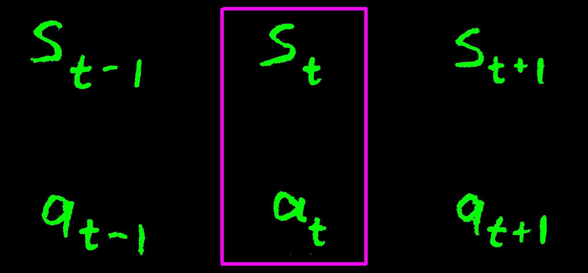

## Neural Network
My first, basic task was to predict the next state. Throughout the rest of this description, I'll be providing diagrams to help clarify what I'm saying. I've adopted a particular notation to simplify these diagrams, which has evolved over the last few years as I incessantly doodle these things for myself. In detailed fashion, I'd use a diagram like what's in **Figure 2** to represent that that there are two variables, *st* and *st+1*, and that there is some neural network that takes as input *st* and outputs a prediction for *st+1*, indicated by *~st+1* in the diagram. We enforce this approximating relationship by calculating an error signal marked by epsilon that represents some sort of difference between *st+1* and *~st+1*. We then take that error signal and use backpropagation to modify the neural network, somewhat clumsily represented by the flat-headed arrow going from epsilon to the neural network arrow (this often gets used to mark inhibitory signals in other fields, so I'm definitely abusing diagramatic notation here). I personally find this all somewhat cluttered, so the diagramatic shorthand I use to represent this situation is show in **Figure 3**. The backwards arrow I use through the following descriptions to indicate the situation that a neural network takes in *st* and tries to predict *st+1*. 

  Figure 2

  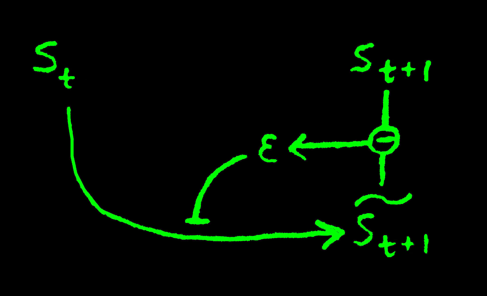

  Figure 3

  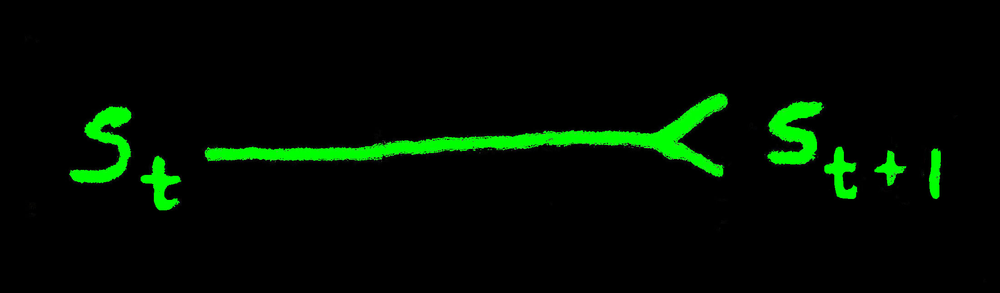

Now, the above goal of predicting the next state of the finger from the previous state of the finger is strictly impossible, because the next state of the finger *st+1* isn't uniquely determined by only the current state of the finger *st*, but rather by both *st* and the current motor commands *at*. The neural network we get out of this arrangement looks like what's in **Figure 4**. Now, the sensor state vector is pretty huge, I forget the exact size but on the order of a thousand dimensions because it's an actual image of the finger. I happen to know that a lot of these dimensions are redundant, because each individual finger only has three degrees of freedom, and most of the image is blank space behind the finger anyway. Since more dimensions between fully connected layers means more parameters to tune during backpropagation, more dimensions means longer training time and higher chance of overfitting. So, I decided to jointly learn a compressed representation *rt* of each state vector *st*, and then predict *rt+1* from *at* and *rt*. The compression from *st* to *rt* is achieved with a convolutional autoencoder with a fully connected end that encodes the image *st* into a new, much smaller state vector *rt*, as seen in **Figure 5**. This allows the fully connected layers from *at* and *rt* to *rt+1* to be much smaller, which makes training a lot faster. I tried training this model on my dataset, but ran into a major problem. My earlier assumption that you could uniquely determine the next camera image from the current camera image and current actuator commands was incorrect! The problem was that for any given position the finger was in, each single motor (which spins continuously) could be in any of two states, since the position of the finger is governed entirely by the vertical displacement of lever arm attached to the motor, but is independent of the cosine of the angle of the lever arm. 

  Figure 4

  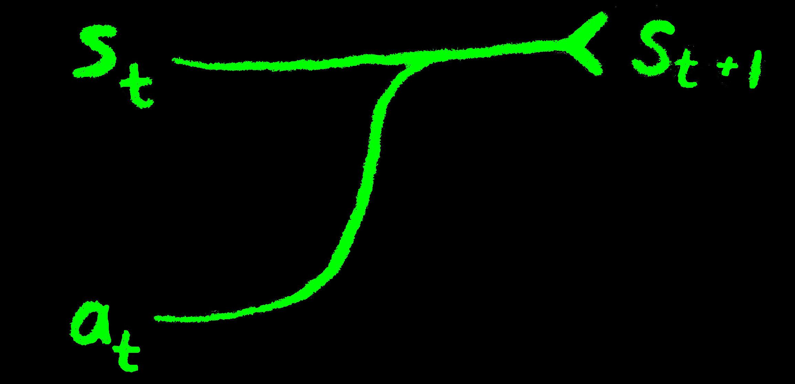

  Figure 5

  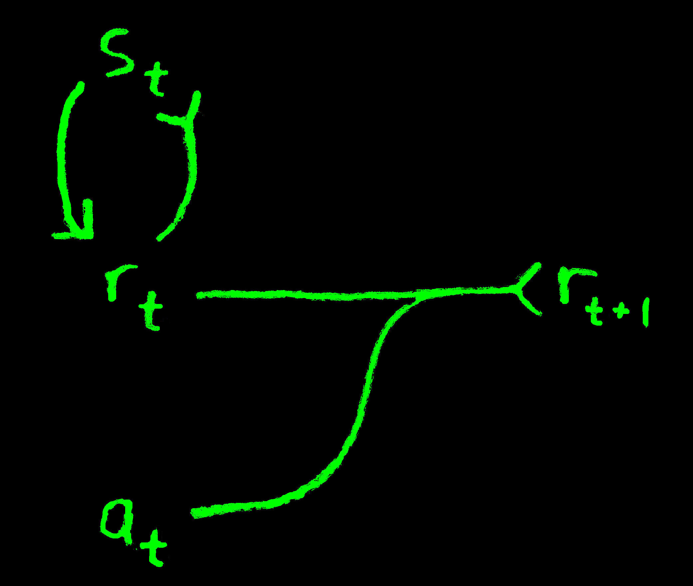

This means the lever that controls the tendon can be at one of two angles (except when point straight up or down) to achieve a given tendon displacement. However, each of these two "hidden states" of the finger will respond differently to a given motor command. I decided to use this to my advantage, by having the neural network learn an inferred motor state pt from the current compressed state *rt*, the previous compressed state *rt-1*, and the previous action command *at-1*. I figured that most of the time, there would be enough information distributed between the three vectors to disambiguate the true motor state, which is what is actually important for predicting the next state of the finger given a motor command. This actually worked! The diagram for that model can be seen in **Figure 6**. Now I had a model that could compress the camera image into a much more compact vector representation of that image, use the previous state and action along with the current state to infer the true state of the entire finger assembly, and then using that inferred state, predict what the next inferred state would be given a certain action, and then decode that true state an image of what the finger would look like. The entire end-to-end trainable neural network is depicted in the diagram in **Figure 7**. The forward model is denoted by *K* and predicts *pt+1* from *pt* and *at*, while the inverse model is denoted by *K\** and predicts *at* from *pt+1* and *pt*. The *K\** model has the added benefit of encouraging the state representation to encode information useful for predicting actions, an idea I got from [this paper](https://arxiv.org/pdf/1705.05363.pdf). This neural network essentially operates as an instantaneous model of the state transitions of the finger, being capable of both predicting future states from current states and actions, or being able to generate the appropriate action in order to achieve a desired next state. However, I soon realized that this was fairly weak, because most states you want to reach aren't instantaneously reachable, they require a sequence of actions. This lead me to the next task. 

  Figure 6

  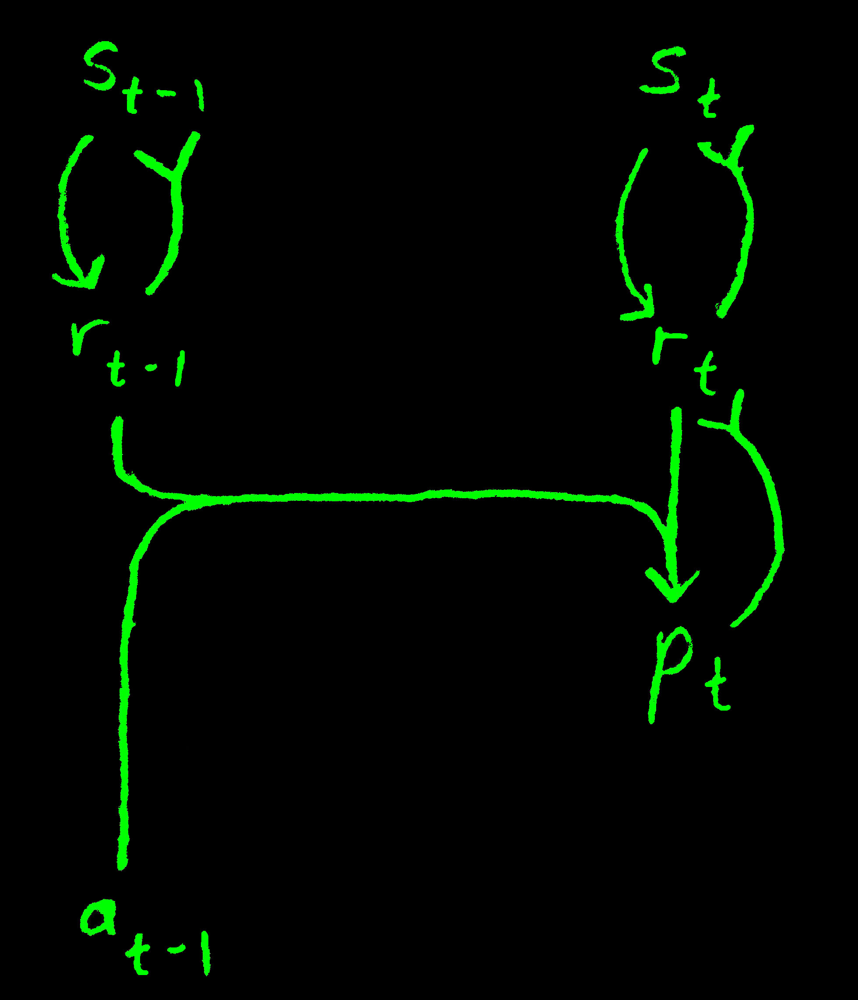

  Figure 7

  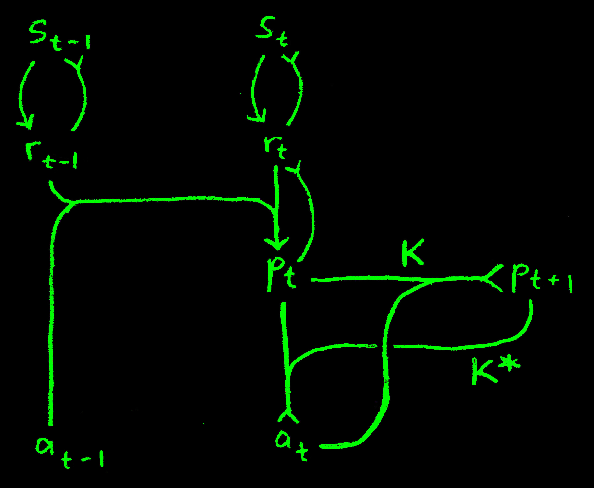

 

## Action Sequences
My first thought for how to generate a specific sequence of actions was to pick a starting state, a desired end state, and a random sequence of actions, then sequentially feed the actions into the forward model to generate next states. This would eventually generate a "final state" that I could compare to the actual desired final state. Since the whole model is differentiable, I figured I could just fix the model weights and use backpropagation to modify the action sequence, treating them as parameters of a model. This is diagramed in **Figure 8**. The loss function is shown in **Figure 9**.

  Figure 8

  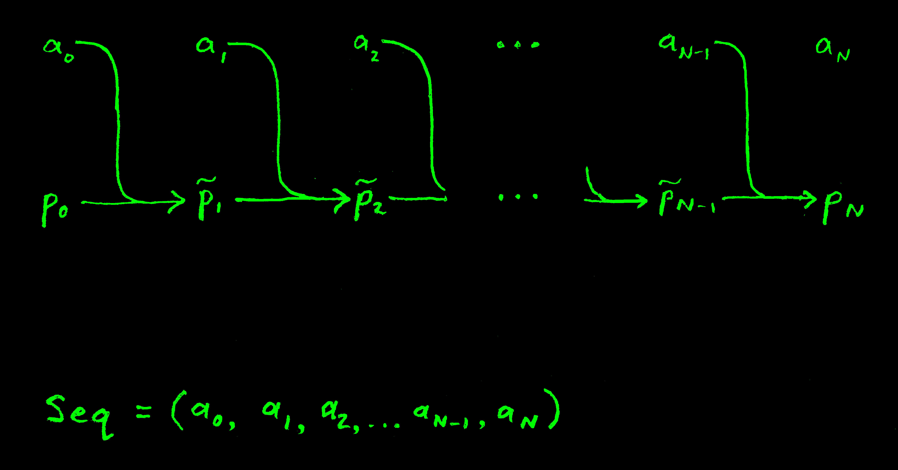

  Figure 9

  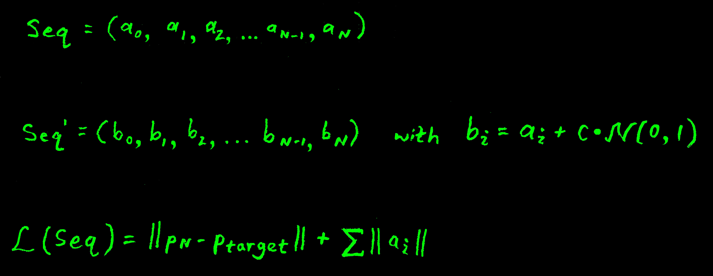

This sort of worked, though very often the optimization process would get stuck in what I assumed were local minima. At this point, I could have done a couple of things, one of which was to figure out if something about the learned representations was faulty or the model had some issues with exploding or vanishing gradients, since I was now essentially treating my feedforward model like a recurrent neural network, and it was possible that some otherwise minor behavior was being amplified by repeated application of the network. Instead of doing that, I just decided to use a genetic algorithm to select sequences. The sequences weren't so long (only about 4 or 5 steps) that this was an impossible tasks, and I was actually able to get it work. The genetic algorithm was very simple, no crossover or anything fancy. I'd just take a whole population of sequences of actions, put them through the learned forward model, evaluate their performance with the loss function *L* (**Figure 9**), rank them and throw away the terrible solutions, then mutate the survivors by adding white noise to them, allowing successful parents to remain in the population, as shown in **Figure 10**. In **Figure 11** you can see an example result of this process, successfully finding a sequence of actions that results in bending the whole finger. 

  Figure 10

  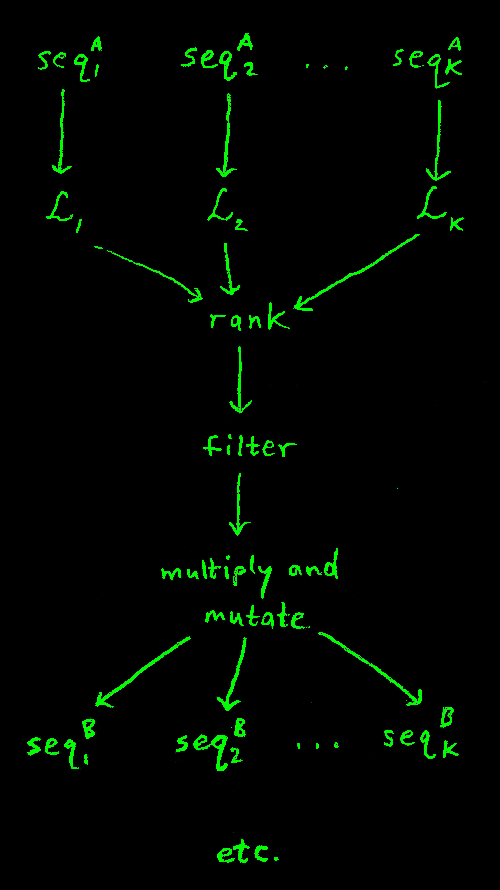

  Figure 11

  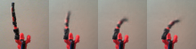

 

## Behavior
Now, this is all pretty fun, but the genetic algorithm takes a bit of time to actually produce these action sequences. I've also been thinking a lot about what behavior is. For a long time I'd sort of abstractly thought of behavior as "just a sequence of physical actions". However, I've realized that this is a pretty brittle way of defining a behavior, because it makes it very natural to think along the lines of "executing" a behavior sequence, and just letting it run it's course, which makes it difficult to factor in how feedback from the environment should influence behavior on-line. Rather, a behavior is probably much more fruitfully thought of as a stable linkage between the sensory inputs and motor outputs. That is, if you thought of an entire organisms linked to it's environment as a dynamical system, you could think of a "behavior" as a specific parameterization of that organisms coupling to its environment. Thinking along these lines, I decided that what I'd do is use the genetic algorithm to create a whole new dataset of state sequences, progressing from a "start" sequence to a "target" sequence. Then, what I'd do is train a new neural network parameterized by the target state (which I'm thinking of as parameterizing the "behavior", which explicitly links a behavior to a goal) such that given the current state, it returns the next state. In the diagram in **Figure 12**, this network is represented by *ϕ*. Then, after *ϕ* has generate the next state, *K\** can generate the action that will produce that state. What this should produce is a system which can correct itself, because even if there's some external perturbation to the system, *ϕ* will always know how to move the system closer to pt. I've already collected this dataset, but still have to train the network. I visualize the result as being something like a parameterize vector field (e.g. **Figure 13**), where the entire behavior *is* the vector field, and the behavior is parameterized by a continuous "goal" variable. 

  Figure 12

  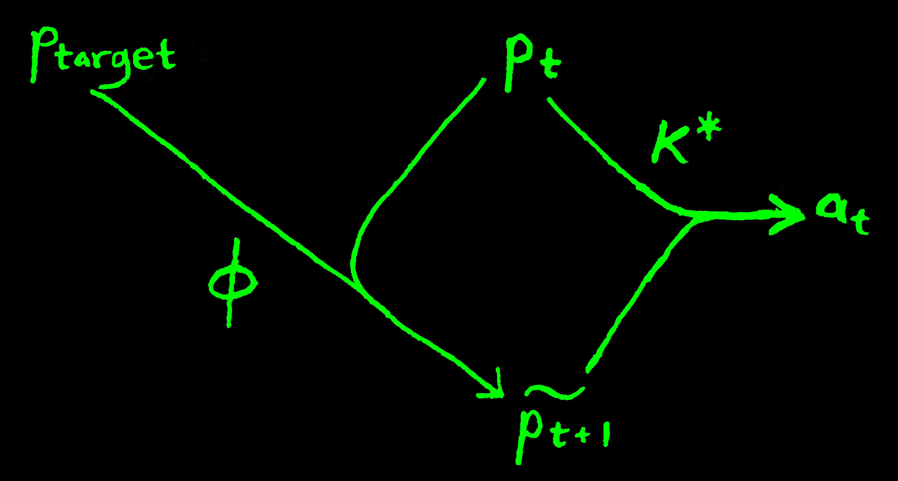

  Figure 13

  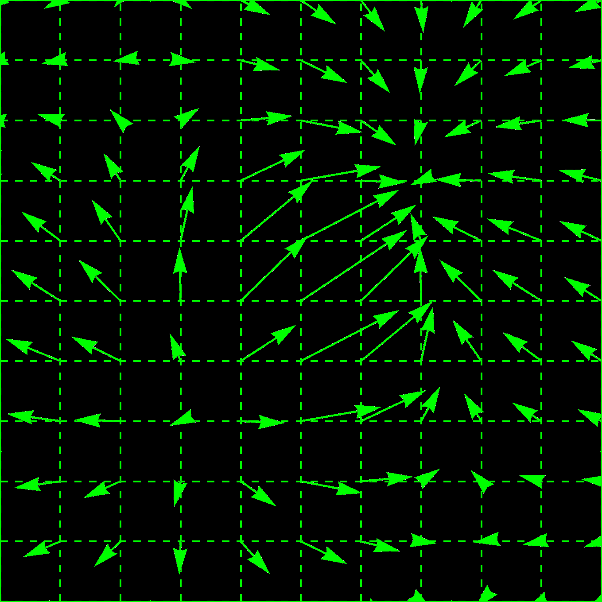

